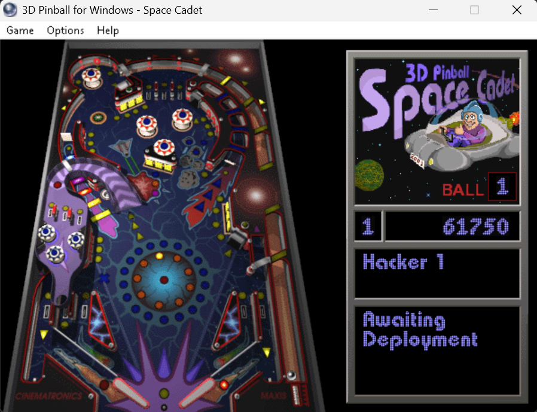

# pinball-hacker
A tool to hack the game 3D Pinball Space Cadet (you know, the classic Windows game).

If you ever wanted to know what happens when you turn on every light, switch, trap, here you go.

<div align="center" style="padding: 30px;">
    
</div>

It supports infinite balls for now. Maybe I'll add more hacks in the future. Not sure.

## Prerequisites

- Microsoft Visual C++ build tools (I tested it with Visual Studio 2019, but probably will work just fine with most versions) with the `cl` compiler available in your shell. You can open a _**"Developer Command Prompt for Visual Studio"**_ to get this environment set up.
- Of course, a copy of **3D Pinball Space Cadet** running in your system.

## How to build

From a Visual Studio Developer Command Prompt or a PowerShell session with MSVC configured, run:

```powershell
.\build.ps1
# or
powershell .\build.ps1
```

This creates `build\pinball-hacker.exe`.

## Using the pre-compiled binary

You can find a pre-compiled binary in the [releases](https://github.com/bryancalisto/pinball-hacker/releases) section. Just download the latest release and extract the `pinball-hacker.exe` from the zip file. I'm just not sure if it will be flagged by antivirus software since it patches another process in memory. Take that into account.

## How to run

With Space Cadet Pinball running, use:

```
.\build\pinball-hacker.exe on
.\build\pinball-hacker.exe off
.\build\pinball-hacker.exe status
```

- `on` enables the hack.
- `off` disables the hack.
- `status` prints whether the hack is currently active. You can determine if whether it's enabled by looking at the "Player 1" string in the score and messages panel. If it's enabled, you'll see "Hacker 1" instead.

## How it works

It searches for the running pinball game process, attaches to it and patches its code.

For instance, for the 'infinite balls' trick, it patches the 'ball decrease' instruction with a NOP so that the ball counter is not decreased.
